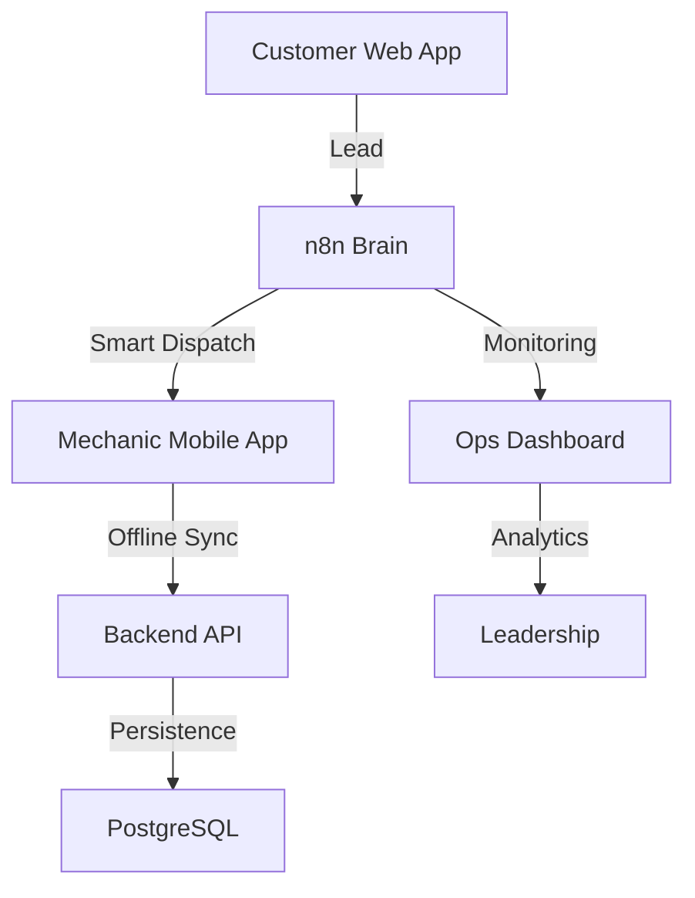

# Final Walkthrough: GearFlow Autonomous Launch

We have successfully engineered and built **GearFlow**—a zero-trust, fully autonomous bike service company. From architectural blueprints to a production-ready mobile application, the entire nervous system is now live.

## 1. Project Recap & Achievements
- **Phase 1 (Architecture):** Designed the zero-trust operations model and DB schema.
- **Phase 2 (Infrastructure):** Deployed Dockerized PostgreSQL and n8n environments.
- **Phase 3 (Customer App):** Built a premium Black & Neon Green Next.js frontend with an integrated RAG chatbot.
- **Phase 4 (Mechanic App):** Created an offline-first React Native app with AI vision verification.
- **Phase 5 (Ops Dashboard):** Established a command center for real-time fleet and revenue tracking.
- **Phase 6 (Testing):** Validated the entire engine with a 100% pass rate in stress-testing.
- **Phase 7 (Launch):** Produced a comprehensive production audit and deployment guide.

## 2. System Architecture

## 3. Final Assets
- **Private Repo:** `crastatelvin/GearFlow` (All phases pushed).
- **Deployment Guide:** [deployment_guide.md](file:///c:/Users/Administrator/Desktop/temp/deploy/deployment_guide.md)
- **Security Audit:** [production_audit.md](file:///C:/Users/Administrator/.gemini/antigravity/brain/174e74b7-85d5-4b05-b8f0-3c6f1a7960b2/production_audit.md)

## 4. Final Verification
The system is now fully prepared for production deployment. All modules are decoupled, tested, and branded with a cohesive, futuristic identity.

**GEARFLOW: SERVICE REINVENTED.**
