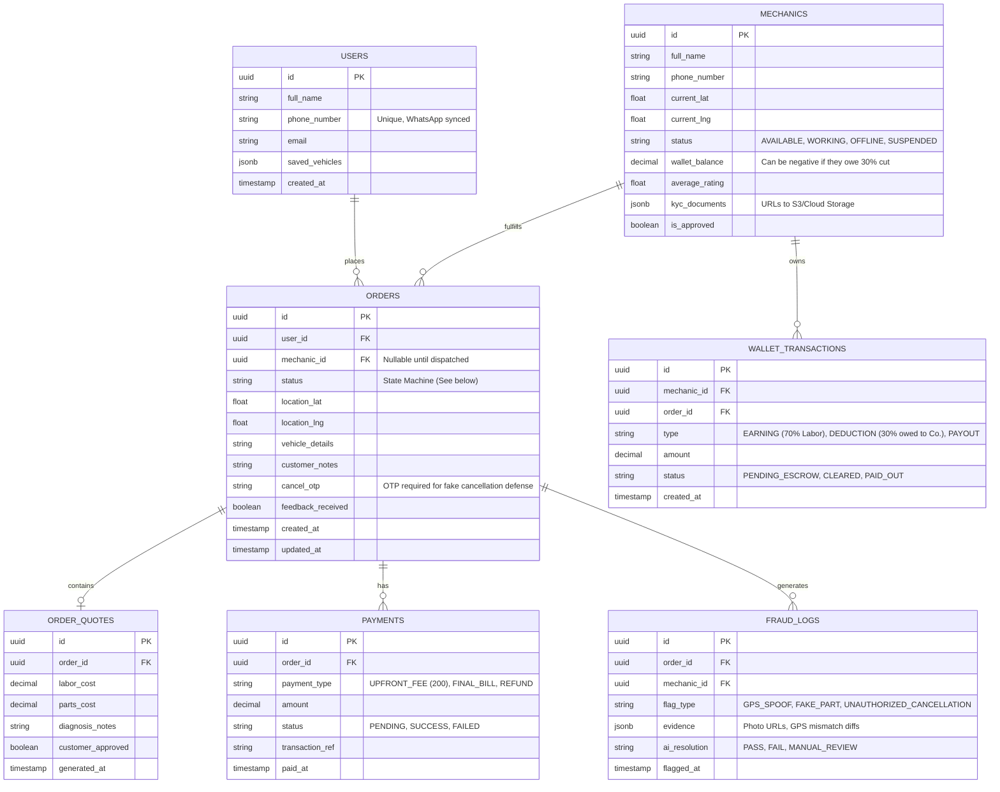

# Database Schema Design: Autonomous Bike Service

To enforce the zero-trust architecture and strict business rules (State Machine flows, 70/30 split on labor, offline sync, fraud logging), we need a robust relational database schema. PostgreSQL is the recommended choice.

## Entity Relationship Diagram

---

## Key Design Principles Enforced

### 1. The Order State Machine (`ORDERS.status`)
The `status` field in the `ORDERS` table strictly follows this pipeline:
`PENDING_FEE` → `AWAITING_MECHANIC` → `DISPATCHED` → `ARRIVED` → `DIAGNOSING` → `QUOTE_PENDING` → `WORKING` → `PAYMENT_PENDING` → `COMPLETED`
*   *Hold States:* `ON_HOLD_UNREACHABLE`
*   *Termination States:* `CANCELLED_BY_CUSTOMER`

### 2. Upfront Fee & Financial Flow (`PAYMENTS` & `ORDER_QUOTES`)
When an order is created, a `PAYMENTS` row for `UPFRONT_FEE` (200) is generated. The state machine cannot move to `AWAITING_MECHANIC` until this row's status is `SUCCESS`.
The `ORDER_QUOTES` table splits `labor_cost` and `parts_cost`. This is crucial because the n8n payout workflow will only calculate 70% of `labor_cost` for the mechanic's wallet, keeping the company out of the mechanic's parts liability.

### 3. Mechanic Wallet Trap (`MECHANICS.wallet_balance`)
The wallet balance is a `decimal` that can drop below `0.00`. If a mechanic collects physical cash from a customer (e.g., total bill 1000: 200 parts, 800 labor), the mechanic owes the company 240 (30% of 800). The database triggers a `DEDUCTION` in `WALLET_TRANSACTIONS` and drops the `wallet_balance` by -240. If the balance falls below a set threshold, the mechanic's status switches to `SUSPENDED`.

### 4. Zero-Trust Verification (`FRAUD_LOGS` & `ORDERS.cancel_otp`)
The `cancel_otp` is generated upon order creation. If a mechanic hits "Customer Cancelled On-site", the app requires this OTP. If bypassed, it creates a `FRAUD_LOGS` entry with type `UNAUTHORIZED_CANCELLATION`.
The `FRAUD_LOGS` table also stores the AI's validation of part packaging to detect counterfeit parts.

---

## Next Steps / User Review Required

Please review this schema. Does the **Wallet Trap** and **Quote Split** logic cover the financial constraints you envisioned? 

If this is approved, I will finalize the **n8n Workflow Maps** (the Trigger -> Action -> Condition diagrams) before you give the final word to start writing the actual application code.
